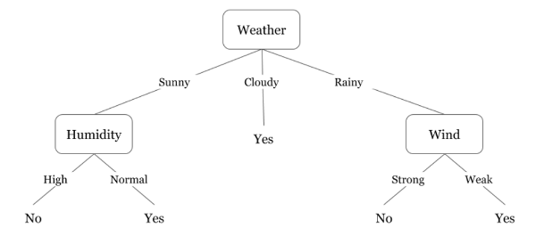
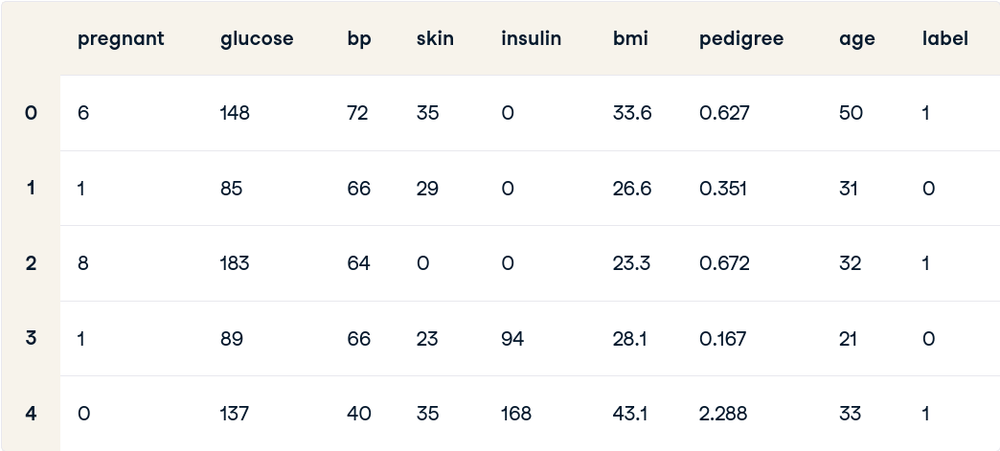

\maketitle

# Assignment 1 {-}

## $Q_1$ Explain the use of decision trees in data science.

**Answer.** Decision trees are a fundamental tool in the field of data science.
They are versatile and intuitive machine learning algorithms used for both
_classification_ and _regression_ tasks. Decision trees work by recursively
splitting the dataset into subsets based on the most significant attribute at
each node. These splits create a tree-like structure of decisions, where each
internal node represents a decision based on a specific feature, and each leaf
node represents the predicted outcome.

- **Decision Making:** Decision trees are excellent for decision-making
  processes. They allow data scientists to visualize decisions and understand
  the implications of each choice.

- **Feature Importance:** By evaluating which features are used for splitting
  nodes, data scientists can prioritize features for further analysis.

- **Non-Linear Relationships:** Decision trees can capture non-linear
  relationships between features and the target variable. Unlike linear models,
  decision trees can model complex patterns in the data.

- **Handling Missing Values:** Decision trees can handle missing values in the
  dataset. They can make decisions even if some values are missing for certain
  features.

- **Interpretability:** Decision trees are easy to interpret and explain to
  non-experts. The visual representation of a tree structure simplifies complex
  decision-making processes.

- **Ensemble Methods:** Decision trees serve as the building blocks for powerful
  ensemble methods like Random Forest and Gradient Boosting. These methods
  combine multiple decision trees to improve predictive performance.

An example of a decision tree is shown below.



## $Q_2$ Take any real-life problem related to data science and solve it using a decision tree to solve in _Python_.

**Answer**. We can use Decision Tree classification to predict the labels from
the Pima Indians Diabetes Database[^dataset].

[^dataset]: https://www.kaggle.com/datasets/uciml/pima-indians-diabetes-database

### Source Code:

```py
# Load libraries
import pandas as pd
from sklearn.tree import DecisionTreeClassifier  # Decision Tree Classifier
from sklearn.model_selection import train_test_split  # train_test_split function
from sklearn import metrics # scikit-learn metrics module for accuracy calculation  

# Loading the Dataset
col_names = [ "pregnant", "glucose", "bp", "skin", "insulin", 
             "bmi", "pedigree", "age", "label" ]
pima = pd.read_csv("diabetes.csv", header=None, names=col_names)
pima.head()

# split dataset in features and target variable
feature_cols = ["pregnant", "insulin", "bmi", "age", "glucose", "bp", "pedigree"]
X = pima[feature_cols]  # Features
y = pima.label  # Target variable

# Split dataset into training set and test set
X_train, X_test, y_train, y_test = train_test_split(
    X, y, test_size=0.3, random_state=1
)  # 70% training and 30% test

# Create Decision Tree classifer object
clf = DecisionTreeClassifier()

# Train Decision Tree Classifer
clf = clf.fit(X_train, y_train)

# Predict the response for test dataset
y_pred = clf.predict(X_test)

# Model Accuracy, how often is the classifier correct?
print("Accuracy:", metrics.accuracy_score(y_test, y_pred))
```

<!-- LaTeX environment in a Markdown document! -->

### Output:



```
Accuracy: 0.6753246753246753
```

\pagebreak

# Assignment 2 {-}

## $Q_1$ Explain the use of prediction and classification in data science.

**Answer.** **Prediction** and **Classification** are two fundamental tasks used
to extract meaningful insights from data and make informed decisions.

### Prediction in Data Science:

**Prediction** involves estimating the value of an unknown variable based on the
available data. It is widely used in various fields, including finance, weather
forecasting, and sports analytics. In data science, predictive modeling helps in
understanding patterns and trends within the data to forecast future outcomes.

#### Techniques for Prediction:

1. **Linear Regression:** It predicts a continuous numerical value based on the
   relationship between variables. _Example:_ Predicting house prices based on
   features like area, number of bedrooms, and location.

2. **Decision Trees:** These are tree-like structures that make decisions based
   on asking a series of questions. _Example:_ Predicting whether a customer
   will buy a product based on their demographic information and past purchase
   history.

3. **Neural Networks:** Deep learning algorithms that learn complex patterns in
   data. _Example:_ Predicting stock prices based on historical market data and
   external factors.

### Classification in Data Science:

**Classification** involves assigning predefined labels or categories to data
points based on their features. It is used in applications like spam email
detection, image recognition, and sentiment analysis. Classification algorithms
help in identifying patterns within the data to categorize new, unseen data
points.

#### Techniques for Classification:

1. **Logistic Regression:** Despite its name, it is used for binary
   classification problems, predicting either of two classes. _Example:_
   Classifying emails as spam or non-spam based on their content and sender
   information.

2. **Random Forest:** An ensemble learning method that builds multiple decision
   trees and merges their predictions. _Example:_ Classifying customer feedback
   into positive, negative, or neutral categories based on the text content.

3. **Support Vector Machines (SVM):** It finds the best hyperplane that
   separates different classes in high-dimensional space. _Example:_ Classifying
   handwritten digits (0 to 9) in image recognition tasks.

Both prediction and classification techniques are crucial in data science and
often overlap. For instance, in a customer churn prediction scenario for a tech
company, you can use predictive modeling to estimate the likelihood of a
customer leaving (prediction) and then classify them as 'churn' or 'no churn'
based on a predefined threshold (classification).

Hence, **Prediction** focuses on estimating numerical values, while
**classification** assigns labels or categories to data points. Understanding
these concepts and employing appropriate techniques empower data scientists to
make accurate predictions and informed decisions, making a significant impact on
various fields, including technology and beyond.

\pagebreak

## $Q_2$ Write a program for text summarization using python.

**Answer.** We can use the NLTK[^nltk] library for text summarization.

[^nltk]: https://www.nltk.org/

### Source Code:

```py
# Importing the libraries
import nltk

nltk.download("stopwords")
nltk.download("punkt")

from nltk.corpus import stopwords
from nltk.tokenize import word_tokenize, sent_tokenize

# Input text - to summarize
text = """..."""

# Tokenizing the text
stopWords = set(stopwords.words("english"))
words = word_tokenize(text)

# Creating a frequency table to keep the score of each word
freqTable = dict()
for word in words:
    word = word.lower()
    if word in stopWords:
        continue
    if word in freqTable:
        freqTable[word] += 1
    else:
        freqTable[word] = 1

# Creating a dictionary to keep the score
# of each sentence
sentences = sent_tokenize(text)
sentenceValue = dict()

for sentence in sentences:
    for word, freq in freqTable.items():
        if word in sentence.lower():
            if sentence in sentenceValue:
                sentenceValue[sentence] += freq
            else:
                sentenceValue[sentence] = freq


sumValues = 0
for sentence in sentenceValue:
    sumValues += sentenceValue[sentence]

# Average value of a sentence from the original text
average = int(sumValues / len(sentenceValue))

# Storing sentences into our summary.
summary = ""
for sentence in sentences:
    if (sentence in sentenceValue) and (sentenceValue[sentence] > (1.2 * average)):
        summary += " " + sentence

# Logging the summary
print(summary)
```

### Input Text:

Metroidvania is a sub-genre of action-adventure games and/or platformers focused
on guided non-linearity and utility-gated exploration and progression. The term
is a portmanteau of the names of the video game series Metroid and Castlevania,
based on the template from Metroid (1986), Castlevania II (1987), Super Metroid
(1994), and Castlevania: Symphony of the Night (1997).

These games usually feature a large interconnected world map the player can
explore, although parts of the world will be inaccessible to the player until
they acquire special items, tools, weapons, abilities, or knowledge within the
game. Acquiring such improvements can also aid the player in defeating more
difficult enemies and locating shortcuts and secret areas, and often includes
retracing one's steps across the map. Through this, Metroidvania games include
tighter integration of story and level design, careful design of levels and
character controls to encourage exploration and experimentation, and a means for
the player to become more invested in their player character through
role-playing game elements. While early examples were usually two-dimensional
side-scrolling platform games, the term has since been applied to top-down and
3D games.

The first Metroid game in 1986 established principles of the non-linear
platformer that were refined through multiple iterations, with Super Metroid in
1994 considered to have polished the style of gameplay core to Metroidvanias.
Castlevania: Symphony of the Night in 1997 is considered the defining
Metroidvania game, incorporating role-playing game elements from The Legend of
Zelda series with non-linear traversal within the Castlevania series; most
subsequent Castlevania games followed its approach and refined the genre.
Symphony of the Night's assistant director, Koji Igarashi, is credited with
establishing key principles of Metroidvanias through his work on other
Castlevania games. In the 2010s, a resurgence in Metroidvanias came about due to
several critically praised, independently developed games.

### Output Summary:

Castlevania: Symphony of the Night in 1997 is considered the defining
Metroidvania game, incorporating role-playing game elements from The Legend of
Zelda series with non-linear traversal within the Castlevania series; most
subsequent Castlevania games followed its approach and refined the genre.
