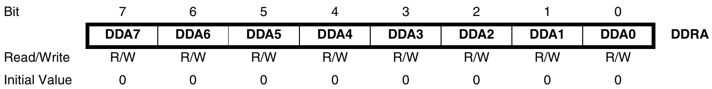
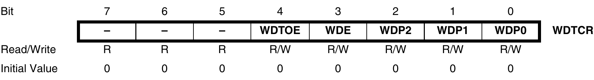

# I/0 Ports

## Pin Configuration

| DDxn | PORTxn | PUD (in MCUCR) | 1/0    | Pull-up |
| ---- | ------ | -------------- | ------ | ------- |
| 0    | 0      | X              | X      | Input   |
| 0    | 1      | 0              | Input  | Yes     |
| 0    | 1      | 1              | Input  | No      |
| 1    | 0      | X              | Output | No      |
| 1    | 1      | X              | Output | No      |

## DDRxn Register

- Configure the direction of the pins on each port.

- 1 in a bit of the DDRxn register sets the pin as an output, while a setting of
  0 sets the pin as an input.

## DDRxn Register

Port A Data Direction Register



## Assembly Code

Set port B pins 0 and 1 high, 2 and 3 low, and define the port pins from 4 to 7
as input with pull-ups assigned to port pins 6 and 7

```asm
; Define pull-ups and set outputs high
; Define directions for port pins
ldi r16, (1<<PB7) | (1<<PB6) | (1<<PB1) | (1<<PB0)
ldi r17, (1<<DDB3) | (1<<DDB2) | (1<<DDB1) | (1<<DDB0)
out PORTB, r16
out DDRB, r17
nop ; Insert nop for synchronization
in r16, PINB ; Read port pins
```

# Watchdog Timer

## Uses

- Preventing the microcontroller from getting stuck in an infinite loop

- Waking the microcontroller from sleep mode

- Rebooting the microcontroller

## Watchdog Timer Counter Register



## Watchdog Timer Prescaler

\begin{center} With $V_{cc} = 3.0$ \end{center}

| WDP2 | WDP1 | WDP0 | No. WDT Osc Cycles | Time-out |
| ---- | ---- | ---- | ------------------ | -------- |
| 0    | 0    | 0    | 16K (16,384)       | 17.1ms   |
| 0    | 0    | 1    | 32K (32,768)       | 34.3ms   |
| 0    | 1    | 0    | 64K (65,536)       | 68.5ms   |
| 0    | 1    | 1    | 128K (131,072)     | 0.14s    |
| 1    | 0    | 0    | 256K (262,144)     | 0.27s    |
| 1    | 0    | 1    | 512K (524,288)     | 0.55s    |
| 1    | 1    | 0    | 1,024K (1,048,576) | 1.1s     |
| 1    | 1    | 1    | 2,048K (2,097,152) | 2.2s     |

## Assembly Code

### To turn off the watchdog timer

```asm
WDT_off:
    wdr ; reset WDT
    ; Write logical one to WDTOE and WDE
    in r16, WDTCR
    ori r16, (1 << WDTOE) | (1 << WDE)
    out WDTCR, r16
    ; Turn off WDT
    ldi r16, (0 << WDE)
    out WDTCR, r16
    ret
```
